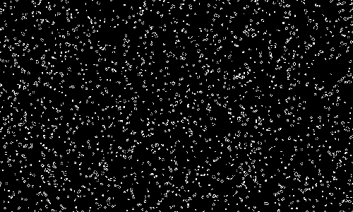
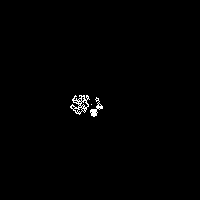
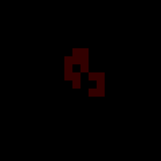
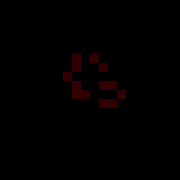
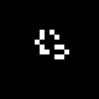

# Game of Life (More Species)
An experiment based on Conway's Game of Life to try and emulate lifelike interactions between species, as well as predatory/parasitic behaviors through a simple ruleset.

**[p5js sketch](https://editor.p5js.org/geckoberry/sketches/HQAFV-gFJ)**
  

# Conway's Game of Life
Conway's Game of Life is a cellular automaton that exists on a square grid, with each cell being either "alive" or "dead". Each cell calculates the # of living neighbors in its 3x3 neighborhood and decides whether to die, stay alive or become alive.
 
<table>
  <tr>
    <td width="410">
      
    </td>
  </tr>
</table>

Because the calculation for each cell is independent of that of another cell,
having a shader perform the calculations in parallel is the most efficient
way of simulating CGOL in larger dimensions.
I used [this tutorial](https://www.youtube.com/watch?v=XcII7comJ00&t=15s) by Barney Codes
to set up a working CGOL with shaders in p5js.

By making slight changes to the rules for CGOL we can create different "species". Here are some examples:
<table>
  </tr>
    <td width="210">
      
    </td>
        <td style="vertical-align: top;">
<pre><code>
for each cell:
  if cell is alive:
    if less than 3 neighbors die
    if more than 5 neighbors die
  if cell is dead:
    if exactly 3 neighbors come to life
  
</code></pre>
  </tr>
</table>
<table>
  <tr>
    <td width="210">
      
    </td>
        <td style="vertical-align: top;">
<pre><code>
for each cell:
  if cell is alive:
    if less than 4 neighbors die
    if more than 7 neighbors die
  if cell is dead:
    if exactly 3 neighbors come to life
  
</code></pre>
  </tr>
</table>
  

# Simulating 2 species
CGOL is partly significant because the single species creates an "equilibrium" where interactions between different structures are always occurring. As shown above, other species are inclined towards growth or decay, so it's interesting to see whether we can achieve equilibrium through inter-species interactions instead.

### Challenge:
In order to add another species to the simulation, we have to add an extra state for each cell. To do this, we can allocate the first two bits of the red channel to our two species, where the 0-index bit is species 1, and the 1-index bit is species 2. This allows us to save the other bits/channels for more species or attributes we might want to add later.

Because the output of this shader pass is hardly visible, we have to run this shader on an offscreen buffer, which we then run a postprocessing shader over to actually visualize the simulation. This was by far the most annoying thing to figure out, especially since there isn't a good way to see what's being done on the GPU from the p5js web editor. Here is a single species visualization of the pipeline:

<table>
  <tr>
    <td align="center" width="25%">
       
    </td>
    <td align="center" width="25%">
       
    </td>
    <td align="center" width="25%">
       
    </td>
    <td align="center" width="25%">
       
    </td>
  </tr>
  <tr>
    <td align="center" width="25%">
      Write input to bit 0 offscreen, send to shader 1
    </td>
    <td align="center" width="25%">
      Shader 1 (conway's simulation)
    </td>
    <td align="center" width="25%">
      Updated offscreen buffer, send output to shader 2
    </td>
    <td align="center" width="25%">
      Shader 2 reads bit 0 to make pretty, write to screen buffer
    </td>
  </tr>
</table>

With this figured out, getting a 2 species simulation running is simple. The first working model was with two identical growing species, only one added rule:
<table>
  </tr>
    <td width="210">
      
    </td>
        <td style="vertical-align: top;">
<pre><code>
for each cell:
  ... 
  {same logic}
  ...
  if cell both red and blue:
    kill red
  
</code></pre>
  </tr>
</table>
  

# Inter-species fun
To encourage more interactions between two species, we can add rules to one or both species that changes growth/death behavior based on the presence of the other species. The first interesting model was between the same growing species (I'll call fungi) and a "virus" species that can't self sustain but will grow in the presence of a host. After some fiddling with the thresholds and random(), the model found a nice equilibrium.
<table>
  </tr>
    <td width="310">
      
    </td>
        <td style="vertical-align: top;">
<pre><code>
for each cell:
  {same fungi logic}
  if cell is virus:
    if less than 2 fungi neighbors:
      if less than 3 virus neighbors die
      if more than 4 virus neighbors die
  if cell is dead:
    if more than 1 fungi neighbor:
      if more than 2 virus neighbors become virus
    else:
      if exactly 3 virus neighbors become virus
  
</code></pre>
  </tr>
</table>
 

By storing the age of a cell (and some postprocessing magic), we can make these interactions look a lot nicer. Here are some of the more interesting rulesets I discovered:

<table>
  <tr>
    <td align="center" width="310">
       
    </td>
    <td align="center" width="310">
       
    </td>
  </tr>
  <tr>
    <td align="center" width="50%">
      same ruleset, virus and fungi
    </td>
    <td align="center" width="50%">
      adding avoidant behaviors for the "prey species" has cool results! also a hardier predator
    </td>
  </tr>
</table>
<table>
  <tr>
    <td align="center" width="310">
       
    </td>
    <td align="center" width="310">
       
    </td>
  </tr>
  <tr>
    <td align="center" width="50%">
      more consistent growth, hiding one species creates cool visuals
    </td>
    <td align="center" width="50%">
      three species, +1 to food chain
    </td>
  </tr>
</table>
  

# Acknowledgements

Thank you to Barney Codes for his Conway's [shader tutorial](https://www.youtube.com/watch?v=XcII7comJ00&t=15s), which was a big help in getting things started. I was inspired by Tom Mohr's [Particle Life](https://www.youtube.com/watch?v=p4YirERTVF0) to look into agent based models and particle/ceullar automata. ChatGPT and p5js documentation were also very helpful.

